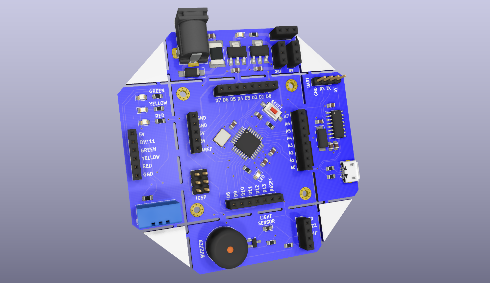

# Modular-Development-Board
Arduino based Modular Development Board.

It has 4 breakable module;
- Humidity - Temperature Sensor and LED Module
- Light Sensor and Buzzer Module
- Power Module
- TTL to UART Converter Module

